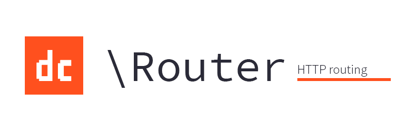

## Installation

```
$ composer install dc/router
```

Or add it to `composer.json`:

```json
"require": {
	"dc/router": "0.*",
    "dc/ioc": "0.*"
}
```

```
$ composer install
```

**This package has a suggests `dc/ioc`, but it really is a very strong recommendation. It will be painful to use without it.**

[/statusIcon)](http://teamcity.digitalcreations.no/viewType.html?buildTypeId=DcRouter_Build&guest=1 "Build status")

# Getting started


We strongly recommend you use this with [the `dc/ioc` package](http://github.com/digitalcreations/ioc "IoC container for PHP"), which we use in all our samples for easy setup. This makes it easy to set up:

```php
<?php
$container = new \DC\IoC\Container();

$container->registerModules([
    new \DC\Router\IoC\Module(['\Fully\Qualified\ControllerName', '\CatsController']),
    new \DC\Cache\Module(),
    new \DC\JSON\IoC\Module()
]);

$router = $container->resolve('\DC\Router\Router');
$router->route($container->resolve('\DC\Router\IRequest'));
```

DC\Router is based around routes and controllers. A route is a single function that gets invoked when a URL is hit.
A controller is a class containing one or more routes that can be invoked if its URL is matched. Here is an example:

```php
class CatsController extends \DC\Router\ControllerBase {
	/**
	 * @route GET /cats
	 */
	function list() {
		return "<h1>many cats here</h1>";
	}
}
```

The magic happens because of two steps:

1. You are inheriting from `ControllerBase`, which implements `IController` for you.
2. You have decorated the `list` method with a `@route` PhpDoc comment to specify which path this matches.

# Routes

The special `@route` PHPDoc comment specifies which URLs match the route. They support variables:

```php
/**
 * @route GET /cats/{id:int}
 */ 
function getById($id) {
  // $id will be an int here
}

/**
 * @route GET /cats/{name}
 */
function getByName($name) {
  // $name will be a string (we didn't have to specify string as it is the default)
}

/**
 * @route GET /cats/{catName}/toys/{toyId:int}
 */
function getToy($toyId, $catName) {
  // notice that the variables for the method do not need to be in the same order as in the route,
  // but they need to have the same names
}

/**
 * @route GET /cats/?filter={cats:catFilter}
 */
function filterCats($cats, $filter) {
  // This uses the catFilter parameter type (see below) to convert the input sent through the 
  // filter GET parameter and provides it with the variable named $cats. The ONLY time you'll 
  // use this, is if you want parameter type conversion, or when you want to rename the query 
  // parameter before it arrives. Note that the $filter parameter is still available, but is 
  // a string 
}
```

# Parameter types

You can register your own parameter types. By simply implementing `IParameterType` you can easily convert a input parameter from a URL into a full-fledged object:

```php
class CatParameterType implements \DC\Router\IParameterType {
  private $catService;  
  function __construct(\ICatService $catService) {
    $this->catService = $catService;
  }
  function getType() { return "cat"; }
  function getRegularExpression() { return "\d+"; }
  function transformValue($id) {
    return $this->catService->get($id);
  }
}
```

You'll need to register this with your IoC container before the routing system is created:

```php
$container = new \DC\IoC\Container();
$container->register('\UserParameterType')->to('\DC\Router\IParameterType')->withContainerLifetime();
\DC\Router\IoC\RouterSetup::route($container, 
	array('\Fully\Qualified\Controller\Name', '\CatsController'));
```

Now you can use it in your own routes:

```php
/**
 * @route GET /cat/{catObject:cat}
 */
function getCatById(\Cat $catObject) {
  var_dump($catObject);
} 
```

# Dependency injection

If you use the setup above, controllers are injected when instantiated, so you can easily specify dependencies:

```php
class CatsController extends \DC\Router\ControllerBase {
  /**
   * @param \ICatToy[] $catToys A list of the toys you have for your cats
   */
  function __construct(\CatService $catsService, array $catToys) {
     // store your catsService and your toys
  }
}
```

# API controllers

If you want to make a JSON API, inherit from `\DC\Router\JsonController` instead. Anything you return will automatically be serialized to JSON before being sent to the client.

These API controllers can also receive posted JSON data, provided the `Content-Type` header is set correctly. To access the posted data in a route, use the `getRequestBodyAsObject()` method:

```php
class CatsController extends \DC\Router\JsonController {
  /**
   * @route POST /cat
   */
  function new() {
     $cat = $this->getRequestBodyAsObject();
     return $cat;
  }
}
```